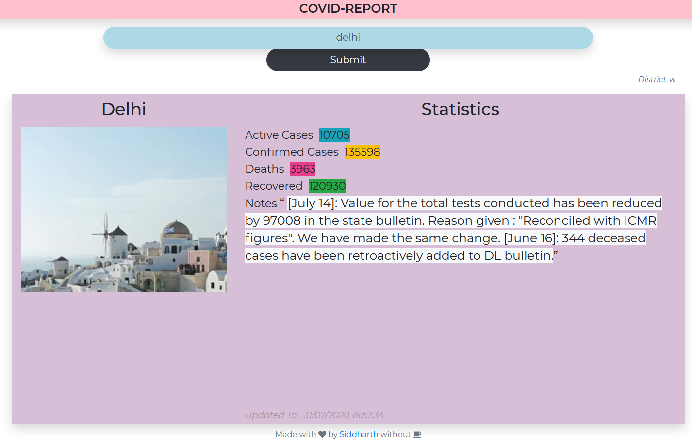
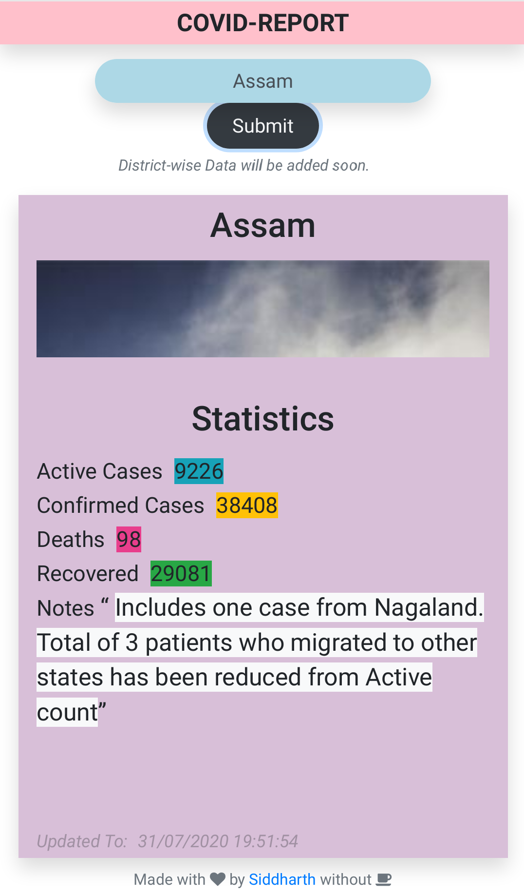

## COVID-REPORT (JS / HTML / CSS)

### _A javascript / html / css project that shows the cunrrent COVID-19 Info for the query._

#### APIS and Dependencies used:

- [covid19india-API](https://api.covid19india.org/) (For Data)
- [BootStrap](https://getbootstrap.com/) (for Style)
- [FontAwesome](https://fontawesome.com/) (For Icons)

#### Screenshots

